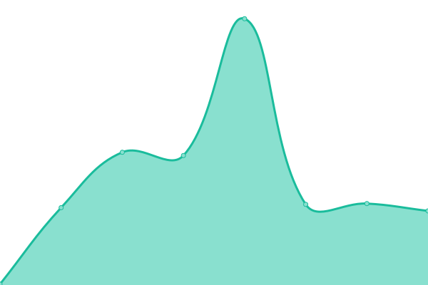
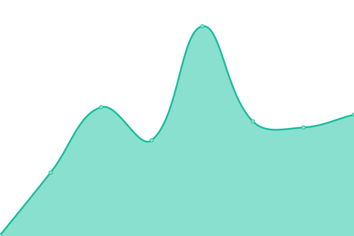

# [📈 Live Status](https://chadburrus.github.io/upptime): <!--live status--> **🟩 All systems operational**

This repository contains the open-source uptime monitor and status page for [Chad Burrus](chadburrus.com), powered by [Upptime](https://github.com/upptime/upptime).

With [Upptime](https://upptime.js.org), you can get your own unlimited and free uptime monitor and status page, powered entirely by a GitHub repository. We use [Issues](https://github.com/chadburrus/upptime/issues) as incident reports, [Actions](https://github.com/chadburrus/upptime/actions) as uptime monitors, and [Pages](https://chadburrus.github.io/upptime) for the status page.

<!--start: status pages-->
<!-- This summary is generated by Upptime (https://github.com/upptime/upptime) -->
<!-- Do not edit this manually, your changes will be overwritten -->
<!-- prettier-ignore -->
| URL | Status | History | Response Time | Uptime |
| --- | ------ | ------- | ------------- | ------ |
|  [Personal](https://chadburrus.com) | 🟩 Up | [personal.yml](https://github.com/chadburrus/upptime/commits/HEAD/history/personal.yml) | 

 140ms
     
 | 

<a href="https://chadburrus.github.io/upptime/history/personal">100.00%</a>
    

|  [Enchanted Vacations](https://yourenchantingvacation.com) | 🟩 Up | [enchanted-vacations.yml](https://github.com/chadburrus/upptime/commits/HEAD/history/enchanted-vacations.yml) | 

 373ms
     
 | 

<a href="https://chadburrus.github.io/upptime/history/enchanted-vacations">100.00%</a>
    

|  [Casey](https://caseyburrus.org) | 🟩 Up | [casey.yml](https://github.com/chadburrus/upptime/commits/HEAD/history/casey.yml) | 

 552ms
     
 | 

<a href="https://chadburrus.github.io/upptime/history/casey">99.49%</a>
    

|  [Woodside](https://woodside-community.church) | 🟩 Up | [woodside.yml](https://github.com/chadburrus/upptime/commits/HEAD/history/woodside.yml) | 

 1042ms
     
 | 

<a href="https://chadburrus.github.io/upptime/history/woodside">99.50%</a>
    

<!--end: status pages-->

[**Visit our status website →**](https://chadburrus.github.io/upptime)

## 📄 License

- Powered by: [Upptime](https://github.com/upptime/upptime)
- Code: [MIT](./LICENSE) © [Chad Burrus](chadburrus.com)
- Data in the `./history` directory: [Open Database License](https://opendatacommons.org/licenses/odbl/1-0/)
